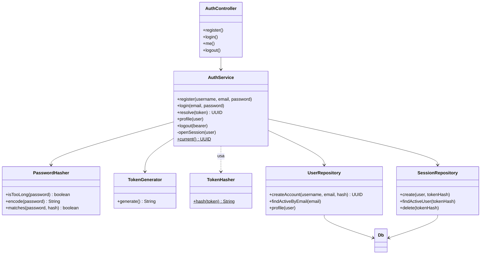

# Refactorización del módulo de autenticación

`AuthService` hacía todo en una sola clase: reglas de contraseña, generación y hash de tokens, SQL de usuarios y SQL de sesiones. Ahora cada responsabilidad vive en una clase pequeña y `AuthService` solo coordina el caso de uso. El comportamiento externo no cambia: las rutas de `AuthController`, los mensajes de error y las consultas SQL son las mismas.

## Diagrama de clases

## Qué hace cada clase

| Clase | Responsabilidad única |
|---|---|
| `AuthService` | Reglas del caso de uso: registrar, iniciar sesión, resolver un token y cerrar sesión. No contiene SQL ni criptografía. |
| `PasswordHasher` | Regla de los 72 bytes de BCrypt, hash de la contraseña y comparación. |
| `TokenGenerator` | Crea tokens aleatorios de 32 bytes con `SecureRandom`. |
| `TokenHasher` | Calcula el SHA-256 del token. En la base de datos solo se guarda este hash. |
| `UserRepository` | SQL de usuarios: crear la cuenta con sus filas iniciales, buscar por correo y leer el perfil. |
| `SessionRepository` | SQL de sesiones: crear, buscar una sesión vigente y borrar. |

## Por qué es mejor

- **Una razón para cambiar cada clase.** Cambiar la duración de la sesión toca `SessionRepository`; cambiar el algoritmo de contraseñas toca `PasswordHasher`.
- **Se puede probar sin base de datos.** `AuthPartsTest` prueba el hash, el generador y la regla de longitud sin Spring ni PostgreSQL.
- **Inyección de dependencias.** `AuthService` recibe sus cuatro colaboradores por el constructor, igual que el resto de los servicios del proyecto.
- **El resto del sistema no se entera.** `SecurityConfig`, `LiveHub` y los controladores siguen usando `resolve(token)` y `AuthService.current()` con la misma firma.
